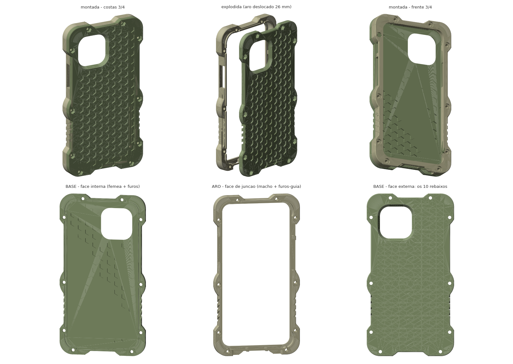

# iPhone 13 Rugged Case — parametric, two-part, 3D-printable

A drop-oriented case for the **iPhone 13 (6.1", 146.7 × 71.5 × 7.65 mm)**, designed to be
printed in **PLA**. It splits into a front frame and a back plate held together by **10 M3
screws running into 10 captive nuts**, so nothing has to stretch over the phone — which is what
makes a rigid filament workable for a case at all.

Everything here is generated by one parametric FreeCAD script, which also re-verifies the model
on every run. The STLs are the output, not the source.



| | |
|---|---|
| Assembled | 87.2 × 162.4 × 13.75 mm |
| Material | 60.3 cm³ ≈ **75 g** of PLA (53 g plate + 22 g frame) |
| Hardware | **10 × M3 × 10 mm button head (ISO 7380)** + **10 × M3 nut (DIN 934)** |
| Back plate | 4.0 mm in the middle, 5.0 mm around the rim |
| Side wall | 3.4 mm (2.4 mm at the grip grooves) |
| Corner shell | 4.0 mm plus a 1.6 mm internal air pocket |
| Lens recess | **2.1 mm** below the outer back face |
| Screen lip | 1.8 mm above the display |

## What you need

- ~75 g of filament (PLA works; see *On PLA* below)
- 10 × M3 × 10 mm button-head screws, ISO 7380. **Not countersunk** — a conical head wedges the
  plastic apart as you tighten it and splits thin PLA walls.
- 10 × M3 nuts, DIN 934 (2.4 mm thick, 5.5 mm across flats)
- A 2 mm hex key

## Printing

**Orientation matters and is different for each part. Getting the frame wrong is the single most
common way to ruin this print.**

| Part | File | Orientation |
|---|---|---|
| Back plate | `capa_v6_base_traseira.stl` | Back face down on the bed (honeycomb side down) |
| Front frame | `capa_v6_aro_frontal.stl` | **Upside down — front lip face on the bed** |

The frame's joint face is only 3.4 mm wide. Put that face on the bed and the first layer is a
thin 460 mm-long ring that will lift. Printed lip-down, the first layer is the 4.9 mm-wide rim
ring, and the whole part comes out without a single support.

The plate has a 1 mm skirt around its rim, so it **cannot** be printed inverted either — the
skirt ring would be the lowest feature and the central slab would be cantilevered over air.

| Setting | Value |
|---|---|
| Layer height | 0.2 mm |
| Perimeters | 3–4 |
| Infill | 25–35 % gyroid |
| PLA | 200–215 °C, bed 60 °C, fan 100 % |
| Supports | **None**, for either part |

Printed lip-down, the roofs of the button windows become bridges — the longest is **30.8 mm**
across a 3.4 mm wall. Turn bridging and full part cooling on. Any sag lands on the inner edge of
the window, which is invisible once assembled. Other bridges are short: 1.6 mm over the corner
air pockets, 6.4 mm over each honeycomb cell, 1.4 mm at the nut pocket ceiling.

### Print the test coupons first

`teste_canto_base.stl` + `teste_canto_aro.stl` are the camera corner of both parts, about
40 minutes together. That pair exercises the camera opening, the tongue-and-groove joint, one
screw with its nut and one reinforced corner. Print those before committing to the full parts —
see the warning about estimated dimensions below.

## Assembly

1. Drop the 10 nuts into the hex pockets on the **back** of the plate. The pockets are
   deliberately tight (5.6 mm for a 5.5 mm nut); if yours come out loose, a dab of glue holds
   them — when you drive the screws, those pockets face down.
2. Drop the phone into the **frame from the back**, screen facing down.
3. Seat the plate. The tongue enters the groove and aligns everything on its own.
4. Drive the 10 screws from the **front rim**: the two mid-side ones first, then the four
   corners crosswise, then top and bottom. The threads are steel now, but what you are
   compressing is PLA — tighten until firm, not until it stops.

If the joint is tight on first assembly, raise `JOINT_GAP` from 0.15 to 0.20 and regenerate. Do
not file the tongue down; it is what keeps the two halves aligned.

## ⚠️ Verify the camera cutout before printing everything

The phone's outer dimensions are Apple's published specification. The **camera island (30.2 mm
square, 6.0/6.2 mm from the edges) and the button positions are my estimates** — Apple does not
publish them. Every cutout is generously sized, but measure before you commit filament, and
adjust `CAM_ISL`, `CAM_FROM_TOP`, `CAM_FROM_SIDE`, `MUTE_Y`, `VOL_Y`, `PWR_Y`.

One property of this geometry helps: `CAM_BUMP_H`, the camera bump height, **does not affect the
part at all** — the opening goes straight through, so that estimate only changes the lens recess
number the script reports. Getting it wrong cannot ruin a print.

After printing, take a photo at **0.5×** and check the corners. If the ultra-wide vignettes,
raise `CAM_FLARE` from 2.2 to 3.0 and regenerate.

The SIM tray is covered — normal for a rugged case. There is no top cutout, and **wireless
charging does not work through this case**: the back is 4.0 mm and Qi wants 3 mm or less between
the charger and the phone. That is a deliberate trade — the same 4 mm is what recesses the lenses.

## Design notes

Almost nothing here is a free choice; each dimension is pinned by something concrete. The
reasons are worth knowing before you modify anything.

**Two parts, split 1 mm above the phone's back plane.** PLA does not stretch, so a one-piece case
cannot be fitted. The phone enters the frame from the back and the plate closes it. The inverse
split (a tub plus a thin front bezel) was rejected on purpose: it would put a face-down drop onto
a thin PLA frame, which is exactly where it breaks. Here the part that takes the impact is the
frame — a closed, stiff ring.

**The plate is a shallow tray, not a flat slab.** It is 4.0 mm in the middle and 5.0 mm around
the rim. The extra millimetre is what gives the nut a ceiling to bear against, and it is only
where the screws are — the middle stays 4.0 mm, because that is what sets the lens recess. It is
added *inward*, by raising the split plane: thickening the outer face would have left the central
slab floating 1 mm above the bed.

**Thick back instead of a raised camera ring.** The lenses sit 2.1 mm below the outer back face
because the back is 4.0 mm thick and the camera island is recessed inside the opening. A raised
ring around the camera — the intuitive solution — is unprintable in the only viable orientation:
with the back on the bed, the ring becomes an isolated island on the first layer with the entire
back plate cantilevered over air.

**Flared camera opening**, 32.0 mm at the phone tapering to 36.4 mm at the outer face (29° from
vertical, self-supporting), so the ultra-wide does not catch the wall of the opening.

**Tongue on the frame, groove in the plate**, 1.4 × 1.6 mm with 0.15 mm clearance per side,
running the whole perimeter. It carries the shear; the screws only clamp axially. That assignment
is deliberate — the other way round, the groove would land in the frame's 3.4 mm wall and leave
two 0.85 mm ribs in the outer skin, the worst possible place in an impact. Both tongue and groove
are interrupted in a 7 mm circle around each screw; a continuous groove would eat the very
ceiling the nut needs.

**Nut in the plate, head on the front rim.** Not an aesthetic choice. A M3 nut needs ~8.2 mm of
band and the frame wall has 7.4 mm, so the nut only fits in the solid slab of the plate — and
since head and nut sit at opposite ends of the clamp, the head has to go to the front rim. The
head recess cannot exceed 1.8 mm deep either: that is the height of the lip, and deeper breaks
into the phone cavity.

**Screw positions** are squeezed between three opposing constraints:

| Group | Position | Gap to next |
|---|---|---|
| 4 at the corners | x = ±39.25, y = ±57.35 | side: **65.85 mm** |
| 2 mid side | x = ±39.25, y = −8.50 | — |
| 2 top edge | x = ±20.00, y = +76.85 | top: **40.00 mm** |
| 2 bottom edge | x = ±30.00, y = −76.85 | bottom: **60.00 mm** |

Outward, the nut pocket is 6.5 mm corner to corner and has to stay where the corner pad is at
full thickness. Inward is the cavity wall — and right behind it, at the corners, the **air
pockets**. Along the bottom edge, the speaker and microphone slots occupy x = 11 to 25 mm. On the
bottom edge those three left no valid position at all, so the air pocket now has a **relief
around every screw**, leaving a solid pillar for the channel to pass through. The pocket survives
everywhere else in the corner, which is where impact actually lands.

The mid-side screws each carry a local 4 mm boss. It **cannot** be centred at y = 0: it would
reach into the volume-button window, and where the boss is, the wall becomes 7.4 mm — the
volume-down button would sit at the bottom of a well. At y = −8.5 it stops 1.2 mm short and the
wall at the button stays 3.4 mm.

**Corner pads with `PAD_R` = 13 mm.** The pads' outer radius used to be inherited from the body
(16.85 mm), which was never a design decision — just a consequence of offsetting the profile, and
it made the corners read as soft lobes. Making it an explicit, smaller parameter squared them off
and, as a side effect, pushed away the outer-surface curvature that was pinching the bottom
screws: their surrounding wall went from 1.00 to 1.40 mm.

**Corner air pockets**, 1.6 mm between the phone corner and a 4.0 mm shell, so the corner deforms
and absorbs instead of working as a solid block.

### Walls are measured, not calculated

Every wall around every hole is **measured on the solid**: the generator builds a ring around
each feature and tests whether it lies entirely inside the material — three measurements per
screw, on every run.

This replaced a formula, and the reason matters. A formula looks along the screw axis, and what
kills you is off the axis: the corner of the hex pocket, the curve of the pad, the air pocket
behind the cavity wall. The formula reported 1.30 mm where the real wall was 0.66 mm, and it
missed a hole that had broken into an air pocket entirely.

Current minimums: **1.40 mm** around the nut pockets, **1.40 mm** around the head recesses,
**1.20 mm** around the screw channels. Interference between the two assembled parts: **0.0000
mm³**, verified by boolean on every run.

### On PLA, honestly

Splitting the case solves **assembly** — you cannot fit a rigid one-piece case over a phone. It
does not solve PLA's brittleness. In a hard drop PLA tends to crack rather than absorb. The
mitigations here (corner air pockets, 4 mm corners, every sharp internal corner filleted so it is
not a stress riser) help, but they do not turn PLA into TPU.

If you want real toughness without redesigning anything: **print the frame in PETG and keep the
plate in PLA**. The frame is the part that hits the ground, and being a two-part assembly they do
not have to be the same material.

## Regenerating and customising

The geometry is not hand-modelled. `case_iphone13.py` builds it and is the file to edit.

```bash
freecadcmd case_iphone13.py       # FreeCAD 1.1+, headless
```

On macOS the binary is at `/Applications/FreeCAD.app/Contents/Resources/bin/freecadcmd`.

Every run re-verifies and prints: both parts valid and single-solid, boolean interference between
them, the three measured walls per screw, the gaps to the camera opening and the speaker slot,
whether the mid-side boss has crept into the volume window, and the thread engagement. If a
parameter change breaks one of those, the script says so instead of quietly producing a broken
part.

`preview.py` and `sections.py` regenerate the renders and the cross-sections.

| I want | Change |
|---|---|
| Squarer / rounder corners | `PAD_R` (13.0; smaller is squarer — see `silhueta_cantos.png`) |
| Self-tapping threads instead of nuts | `FASTENER = "autoatarraxante"` (the skirt goes with it) |
| Six screws instead of ten | `SHORT_EDGE_SCREWS = False` |
| Single piece for TPU | `TWO_PIECE = False` |
| Looser joint | `JOINT_GAP` 0.15 → 0.20 |
| Looser nut pockets | `NUT_AF` 5.6 → 5.7 |
| More lens recess | `BACK` 4.0 → 4.6 |
| Lighter | `HEX_DEPTH` 1.2 → 1.8 |
| Kill 0.5× vignetting | `CAM_FLARE` 2.2 → 3.0 |
| Looser / tighter fit | `CLR_XY` (0.45 mm per side) |
| Chunkier corners | `BUMP` 4.0 → 5.0 |
| Mirror the whole case | `MIRROR = True` |

Adapting it to another phone means the block of dimensions at the top of the script — length,
width, thickness, corner radius, camera island, button positions.

## Files

| File | What it is |
|---|---|
| `capa_v6_base_traseira.stl` | Back plate, ready to slice |
| `capa_v6_aro_frontal.stl` | Front frame, ready to slice (**print upside down**) |
| `teste_canto_base.stl`, `teste_canto_aro.stl` | Camera-corner test coupons — print these first |
| `capa_v6_conjunto.step` | Both parts as named BRep solids, for CAD (Fusion, Onshape, SolidWorks…) |
| `capa_v6.FCStd` | FreeCAD document |
| `case_iphone13.py` | The parametric generator — the actual source |
| `preview.py`, `sections.py` | Render and cross-section scripts |
| `preview.png`, `cortes.png` | Views and verification sections |
| `silhueta_cantos.png` | Corner silhouette for five values of `PAD_R` |

## Licence

- **`case_iphone13.py`, `preview.py`, `sections.py`** — [MIT](LICENSE)
- **The design** (`*.step`, `*.stl`, `*.FCStd`, renders) — [CC BY-SA 4.0](LICENSE-DESIGN.md)

You may print and sell this case; credit José Macário (@zmacario), link back here, and share
modifications of the design under the same licence. See [LICENSE-DESIGN.md](LICENSE-DESIGN.md).

Not affiliated with Apple. "iPhone" is a trademark of Apple Inc.
